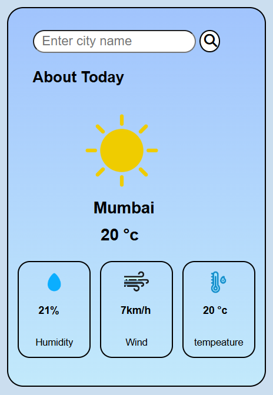

# 🌦️ Real-Time Weather App

A responsive Weather Application built using HTML, CSS, and JavaScript that fetches real-time weather data using an external API. Users can search for any city and get current weather details instantly.

---

## 🚀 Features

* Search weather by city name
* Real-time weather data using API
* Displays temperature, humidity, and weather condition
* Dynamic UI updates based on weather
* Responsive design for all devices

---

## 🛠️ Tech Stack

* HTML5
* CSS3
* JavaScript (Vanilla JS)
* Weather API (e.g., OpenWeather API)

---

## 📂 Project Structure

* index.html
* style.css
* script.js

---

## 💡 How It Works

* User enters a city name
* JavaScript sends a request to the weather API
* API returns real-time weather data
* Data is displayed dynamically on the UI

---

## 📸 Screenshots

---

## 📌 Future Improvements

* Add 5-day weather forecast
* Detect user location automatically
* Add loading animation
* Improve UI with icons and themes

---

## 🙌 What I Learned

* Working with APIs (fetch/async-await)
* Handling JSON data
* DOM manipulation
* Building real-time applications

---

## ⚠️ Disclaimer

This project uses a public weather API for educational purposes.

---

## 📃 License

This project is created for learning purposes.
